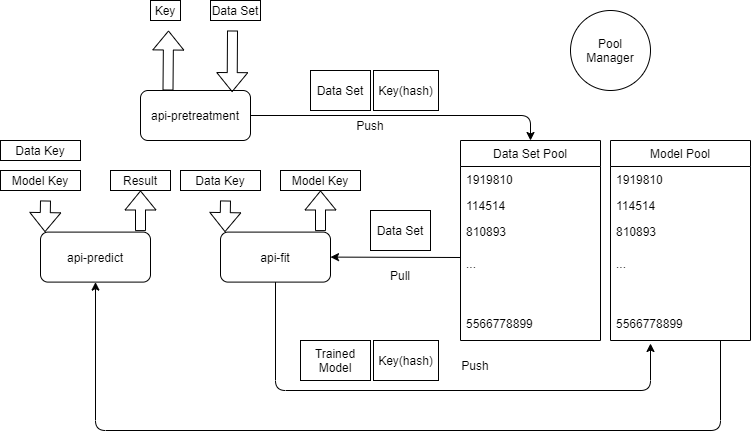

## /api-DataFrame

- **METHOD**: POST
- **Args**:
  - dataSet: the data set originally loaded to submit,
  - sep: the separate character
- **Return:**
  - DataFrame as Json shape like:
  - ["id" : ["1","2", "3", "4"], "feature1" : ["abc", "12fw", "nmd", "wtm", "haode1"]]

## /api-pretreatment

- **METHOD**: POST
- **Args**:
  - dataSet: the data set to submit, must be shaped like :
    - ["id" : ["1","2", "3", "4"], "feature1" : ["abc", "12fw", "nmd", "wtm", "haode1"]]
  - dropColumns: the columns to be dropped, must have the same length of the columns of data set like :
    - ["id", "feature1"]
  - discreteColumns: the columns with discrete elements value like:
    - ["feature1"]
  - textColumn: the columns with Text like:
    - "text"
- **Return:**
  - The hash key to pull data set and a status code (200 for OK, 403 for error)

## /api-fit

- **METHOD**: POST
- **Args**:
  - hashKey: the hash key to pull data set
  - target: the target our model should predict and we call "label" as term
  - model: the model chosen to fit the data set
    - 1: Naive Bayes
    - 2: KNN
    - 3: SVM
    - 4: Linear Regression
    - 5: Logistic Regression
    - 6: Decision Tree
- **Return:**
  - The hash key to pull train Model and a status code (200 for OK, 403 for error)

## /api-predict

- **METHOD**: POST
- **Args**:
  - hashKeyI: the hash key to pull data set
  - hashKeyII: the hash key to pull trained model
- **Return:**
  - The result in JSON shape and a status code (200 for OK, 403 for error)

## How to explain the Pool Manager?

All in this Image.

